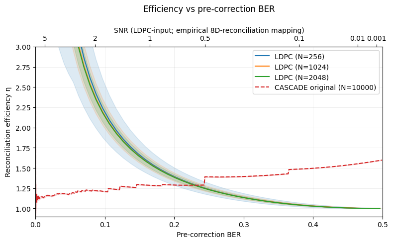
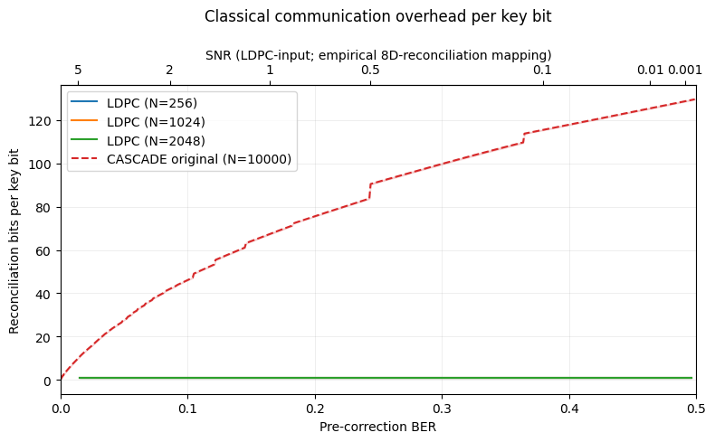
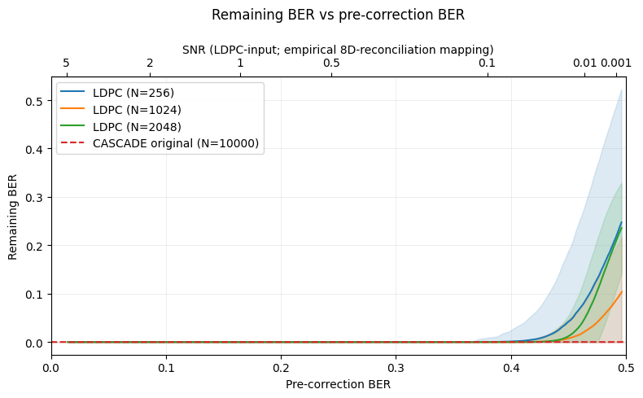
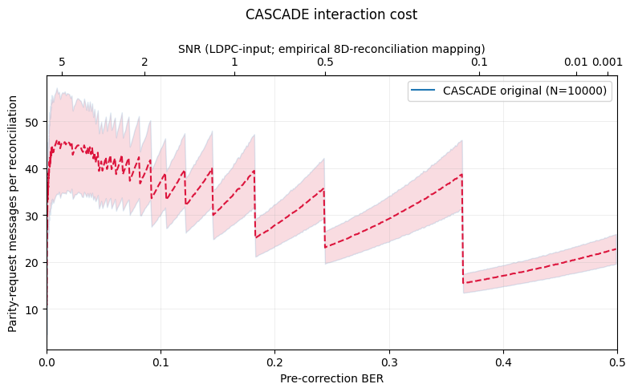

<div align="center">

# A Comparative Study on Error Correction Algorithms for LEO-Based CubeSats

**LDPC vs. Cascade information reconciliation for continuous-variable QKD under CubeSat-style constraints**

[](https://www.york.ac.uk/)
[](https://en.wikipedia.org/wiki/C11_(C_standard_revision))
[](https://isocpp.org/)
[](https://www.python.org/)
[](https://cmake.org/)

*Author: **Maciek Zaweracz** · Supervisor: Dr Adrian Bors · BSc Computer Science*

</div>

---

## Abstract

This repository supports a simulation and systems study comparing **one-way quasi-cyclic LDPC** reconciliation (via the SPOQC-oriented [`cvqkd-reconciliation`](cvqkd-reconciliation/) library) with the **interactive Cascade** protocol (via [`cascade-cpp`](cascade-cpp/), after Bruno Rijsman’s reference implementation). Work is framed around **LEO CubeSat** limits on compute, memory, classical bandwidth, and pass time, in the context of **continuous-variable quantum key distribution (CV-QKD)** and the **Satellite Platform for Optical Quantum Communications (SPOQC)**.

**Part I** sweeps channel difficulty and records reconciliation efficiency, residual errors, classical overhead, timings, and interaction counts under **matched pre-correction bit error rate** between pipelines. **Part II** maps those measurements onto a first-order mission model (quantum window, RF vs. optical classical links, compute pace scenarios). Full methodology, results, and ethics statement are in the LaTeX dissertation (`Overleaf-Dissertation-Files/`).

---

## Table of contents

- [Repository layout](#repository-layout)
- [Prerequisites & running](#prerequisites--running)
- [Sample figures](#sample-figures)
- [Analysis](#analysis)
- [LDPC statistics tracking](#ldpc-statistics-tracking)
- [Upstream and mission context](#upstream-and-mission-context)

---

## Repository layout

| Path | Role |
|------|------|
| [`cvqkd-reconciliation/`](cvqkd-reconciliation/) | C library: CV-QKD-style channel, 8D reconciliation, Min–Sum LDPC; **`ldpc_experiment`** benchmark binary |
| [`cascade-cpp/`](cascade-cpp/) | C++17 Cascade reference; **`bin/run_experiments`** drives JSON-defined sweeps |
| [`experiments/scripts/run_sweep.py`](experiments/scripts/run_sweep.py) | YAML-driven orchestration for LDPC SNR × matrix sweeps |
| [`experiments/config/`](experiments/config/) | Example sweep configuration |
| [`experiments/scripts/part_1_results.ipynb`](experiments/scripts/part_1_results.ipynb) | Part I plots and tables |
| [`Overleaf-Dissertation-Files/`](Overleaf-Dissertation-Files/) | UoYCS LaTeX project and bibliography |

---

## Prerequisites & running

| Piece | Need |
|--------|------|
| **LDPC** | CMake ≥ 3.10, C11 (`clang`/`gcc`) |
| **Cascade** | C++17 `clang++`, Boost (`program_options`, `filesystem`), pthread; GTest for `make test`. Apple Silicon: Homebrew paths in [`cascade-cpp/Makefile`](cascade-cpp/Makefile). |
| **Python** | [uv](https://docs.astral.sh/uv/), Python ≥ 3.12 ([`pyproject.toml`](pyproject.toml) / [`uv.lock`](uv.lock)) |

**LDPC** (from repository root)

```bash
cmake -S cvqkd-reconciliation -B cvqkd-reconciliation/build && cmake --build cvqkd-reconciliation/build
# optional single point: cvqkd-reconciliation/build/ldpc_experiment 0.07 123 10000 cvqkd-reconciliation/data/B_matrices/1024x1023_z1.coo 8

uv sync && uv run python experiments/scripts/run_sweep.py experiments/config/sweep_snr_ldpc.yaml
```

[`ldpc_experiment`](cvqkd-reconciliation/src/examples/ldpc_experiment.c) writes one **NDJSON** line per (matrix, SNR) into the run’s output dir; YAML keys: `ldpc.binary`, `b_matrices`, `snr` / `snr_points`, `frames_per_point`, `output.raw_dir`.

**Cascade** (from repository root)

```bash
cd cascade-cpp && make bin/run_experiments && mkdir -p study/data/dissertation && \
  ./bin/run_experiments study/experiments_papers_ec_compare.json --output-dir study/data/dissertation
```

JSON schema: [`cascade-cpp/README.md`](cascade-cpp/README.md). Upstream full suite: `make data-papers`.

---

## Sample figures

Part I outputs under [`experiments/graphs/results/`](experiments/graphs/results/) (regenerate via [`part_1_results.ipynb`](experiments/scripts/part_1_results.ipynb)).

| Reconciliation efficiency η (matched pre-correction BER) | Classical bits per reconciled key bit |
|:---:|:---:|
|  |  |

| Residual BER after correction | Cascade sequential parity messages per frame |
|:---:|:---:|
|  |  |

More plots in the same folder (e.g. FER, timings, SNR–BER mapping, zooms).

---

## Analysis

[`experiments/scripts/part_1_results.ipynb`](experiments/scripts/part_1_results.ipynb) — Part I plots and tables. Use the `.venv` from `uv sync` (or `uv run …`).

---

## LDPC statistics tracking

[`cvqkd-reconciliation`](cvqkd-reconciliation/) gained **NDJSON stats** from each `ldpc_experiment` run, with fields aligned to **`cascade-cpp`** experiment JSON so one analysis path covers both codes. Per-frame values are aggregated with **Welford’s method** in [`qkd_stats.c`](cvqkd-reconciliation/src/qkd_stats.c) (stable mean/σ without storing every trial). Efficiency uses the same Shannon/BSC definition as Cascade, from measured pre-correction BER.

---

## Upstream and mission context

| Component | Origin / notes |
|-----------|----------------|
| **Cascade-cpp** | [brunorijsman/cascade-cpp](https://github.com/brunorijsman/cascade-cpp) (vendored/forked here with local `Makefile` tweaks). |
| **cvqkd-reconciliation** | Quantum Communications Hub / SPOQC-oriented CV-QKD reconciliation library; Hub-supervised use. Statistics NDJSON extension is intended to ship with the mission codebase. |
| **SPOQC / HOGS** | 12U CubeSat and ground segment context for CV-QKD from space. See [website](https://www.quantumcommshub.net/research-community/about-the-hub/phase-2/work-package-5/the-hubs-spoqc-mission/).  |

---

## Acknowledgements

Supervision: **Dr Adrian Bors** (University of York). Quantum communications context: **Dr Rupesh Kumar**. Systems and implementation guidance: **Killian Murphy**. SPOQC / LDPC matrix design: SPOQC team (acknowledged in the dissertation). Cascade-cpp: **Bruno Rijsman** and contributors.

---

<div align="center">

<sub>Repository layout and commands reflect the state of this workspace; adjust paths if you relocate build directories.</sub>

</div>
