# Comparing LDPC and CASCADE for LEO CubeSat GMCS CV-QKD: Progress Update

## Summary of what I've done so far

- Found an off-the-shelf implementation of the Cascade algorithm in C++: [`cascade-cpp`](https://github.com/brunorijsman/cascade-cpp).
- Explored both the CASCADE and LDPC codebases to understand how they run experiments, how the algorithms fit into the larger CV-QKD scheme, and which parameters they track.
- Implemented a roughly equivalent parameter-tracking system for LDPC so that its outputs can be compared against `cascade-cpp`.
- Recreated graphs from literature and prior project material to help verify both implementations. (No publications for LDPC but matched one of Ed's december update graphs)
- Compared the algorithms across tracked parameters by sweeping SNR (extension: maybe add key_size sweep?) and matching on measured QBER.
- Started building a feasibility / constraints model for the LEO CubeSat scenario.

**Current state of things:** I can run both algorithms on my hardware and produce plots of the tracked parameters.

## Summary of main findings

Incomplete notes and ideas to keep in mind for results and evaluation:

- The graphs suggest the algorithms are usable in quite different operating regimes. LDPC works much better at lower SNR ranges, though this depends on the chosen B-matrix / syndrome. CASCADE only really works at high SNR (low QBER), because it requires many classical round-trips for every error.
- At low SNR, CASCADE incurs a much larger number of parity exchanges, pushing reconciliation bits far above the Shannon limit and therefore giving poor efficiency.
- CASCADE works reasonably at QBER around `0.1` and below, corresponding roughly to SNR `0.75+`.
- LDPC with the currently tested B-matrices works best at lower SNR values, where efficiency is around `1.xx`, only slightly above the theoretical minimum.
- points still to investigate: changing key rate, LDPC B-matrix choice, CASCADE iteration choice, worst-case performance, and practical system metrics such as pass-duration impact, CPU use, and power.

## What `cascade-cpp` tracks

```cpp
using namespace Cascade;

Stats::Stats():
    elapsed_process_time(0.0), // Actual thread CPU time (THREAD_CPUTIME_ID, doesn't include sleep or waiting for I/O time)
    elapsed_real_time(0.0), // Wall clock time - Real time (MONOTONIC - includes sleep time, waiting for I/O time etc.)
    normal_iterations(0), // Always 4 for original CASCADE
    biconf_iterations(0), // Number of BICONF iterations - 2 normal + up to 10 biconf iterations
    start_iteration_messages(0), // normal + biconf iterations - Number of messages sent (Total always 4 for original CASCADE)
    start_iteration_bits(0), // iteration number + seed summed over all iterations - see shuffle seed below.
    ask_parity_messages(0), // Number of round-trips, each message can contain many blocks.
    ask_parity_blocks(0), // number of blocks parity was asked for (total across all round-trips) - number of parity checks asked for.
    ask_parity_bits(0), // Number of bits parity was asked for (total across all round-trips) - 16 (header) + nr_blocks * 80 (parity bits)
    reply_parity_bits(0), // Number of bits parity was replied for (total across all round-trips) - 16 (header) + nr_blocks * 1 (parity bit)
    reconciliation_bits(0), // Total bits sent over classical channel: reconciliation_bits = start_iteration_bits + ask_parity_bits + reply_parity_bits
    efficiency(0.0), // Efficiency of the reconciliation process - reconciliation_bits / (key_size * shannon_efficiency)
    reconciliation_bits_per_key_bit(0.0), // Normalised overhead --- reconciliation_bits / key_size --- Classical communication overhead per key bit.
    infer_parity_blocks(0) // Number of blocks whose correct parity was inferred from parent and sibling parities instead of being asked from Alice.

    // SHUFFLE SEED: Original uses shuffle_seed (32 bits for iteration number + 64 for seed) or full shuffle (32 + 32 * shuffle->get_nr_bits() bits).
{
}
```

## The LDPC tracking implementation

This was developed in a local `feature/stat-tracking` branch of `cvqkd-reconciliation`. - I didn't get to ask if I can push to GitHub.

Results are serialized as **NDJSON** with one JSON object per operating point, matching the `cascade-cpp` output shape to simplify cross-algorithm parsing. Statistics are accumulated over repeated independent LDPC frames using **Welford's online algorithm**, which provides a numerically stable running mean and sample standard deviation. [https://en.wikipedia.org/wiki/Algorithms_for_calculating_variance#Welford%27s_online_algorithm] - TL;DR Cascade uses 'Naive one pass' method, both produce equivalent results, but Welford's is more stable numerically. 

Unlike CASCADE, which averages over repeated full-key runs, LDPC averages over repeated frames whose size depends on the B-matrix. That means the sample counts can match directly, but the statistical significance per sample still depends on frame length. To make the comparison fairer, I've decided to normalise several metrics to `_per_key_bit` (only applies for real/ process time at the moment). This is how they do it in `Mueller et al. 2025` Comparison of LDPC vs CASCADE, though they use a blind LDPC protocol so they have a few extra metrics worth tracking.

`QKD_stats.c` contains the Welford helpers plus the aggregation logic (+print as NDJSON).

Here's a snippet of the stats I have implemented tracking for:

```c
        ...
        stats->algorithm_name, // Always 'LDPC'
        stats->key_size,
        stats->reconciliations, // Number of frames processed
        stats->snr,
        exec_time, // UTC timestamp of start of run
        stats->actual_bit_errors.mean,
            welford_deviation(&stats->actual_bit_errors),
        stats->actual_bit_error_rate.mean,
            welford_deviation(&stats->actual_bit_error_rate),
        stats->remaining_bit_errors.mean,
            welford_deviation(&stats->remaining_bit_errors),
        stats->remaining_bit_error_rate.mean,
            welford_deviation(&stats->remaining_bit_error_rate),
        stats->remaining_frame_error_rate.mean,
            welford_deviation(&stats->remaining_frame_error_rate),
        stats->elapsed_process_time.mean,
            welford_deviation(&stats->elapsed_process_time),
        stats->elapsed_real_time.mean,
            welford_deviation(&stats->elapsed_real_time),
        stats->normal_iterations.mean, // iterations of min-sum decoder used for each frame
            welford_deviation(&stats->normal_iterations),
        stats->reconciliation_bits.mean, // Syndrome size, usually constant for each B-Matrix
            welford_deviation(&stats->reconciliation_bits),
        stats->reconciliation_bits_per_key_bit.mean,
            welford_deviation(&stats->reconciliation_bits_per_key_bit),
        eff_avg, //Efficiency calculated the same way as CASCADE-CPP --- reconciliation_bits / (key_size * shannon_efficiency)
        eff_dev
    );
```

`ldpc_experiment.c` runs a full GMCS CV-QKD simulation path for one `(B-matrix, SNR)` operating point:

- Gaussian generation
- additive noise
- 8D reconciliation preprocessing
- syndrome generation
- LDPC Min-Sum decoding
- per-frame metric collection

The means and sample standard deviations are then calculated over repeated independent LDPC frames. So if `frames_per_point: 10000`, then for each `(matrix, snr)` combination, the binary is invoked once and processes `10000` LDPC frames.

Usage:

```bash
./build/ldpc_experiment <snr> <seed> <no. of frames to run> <B-Matrix path> <QKD dimension (default is 8)>
```

### Experiment runner

Outside the `cvqkd-reconciliation` repository, in my `qunatum-error-correction-codes-comparison` repository I have a config YAML file and a python `run_sweep.py` with UV package manager, which lets me run multiple combos of (B-matrix, SNR) using `ldpc_experiment.c`

Example config:

```yaml
experiment_name: "snr_sweep_0_to_7_5_1000frames_per_point"
seed: 123
# Option A: explicit list
# snr_points: [0.001, 0.01, 0.1, 0.5, 1.0, 2.0]
# Option B: geometric range (start, end, step_factor)
snr:
  start: 0.0001
  end: 7.5
  step_factor: 1.1
frames_per_point: 10000
ldpc:
  binary: "cvqkd-reconciliation/build/ldpc_experiment"
  b_matrices_dir: "cvqkd-reconciliation/data/B_matrices"
  b_matrices: ["256x255_z1.coo", "512x511_z4.coo", "1024x1023_z1.coo"]
  qkd_dimension: 8
output:
  raw_dir: "experiments/data/raw"
```

Usage of the sweep runner:

```bash
uv run experiments/scripts/run_sweep.py experiments/config/sweep_snr_ldpc.yaml
```

### Summary of experiment runners

CASCADE processes `10000` bits per run and averages the statistics over repeated independent runs. LDPC processes `B-matrix`-sized frames such as `256`, `1024`, and `2048` bits, and averages the statistics over repeated independent frames.

An LDPC code with frame length around `10000` bits would most closely resemble cascade in terms of FER, clock times and useful bits per pass, but we can scale metrics to per_key_bit to get comparable results. This is why STD of CASCADE is much lower, because we process a lot more bits (I think).

## Verifying the correctness of both algorithms

The main verification comes from comparing my plots against public literature and prior project plots.

CASCADE also has unit tests for its components. LDPC currently has framework support but no equivalent test coverage yet. (might need to make some?)

### Cascade

The efficiency graph generated by my workflow matches the original `cascade-cpp` author's graph, which in turn aligns with Figure 1 from *Demystifying the Information Reconciliation Protocol Cascade*.

#### My efficiency graphs

Created with my workflow. The second graph extends the range toward lower SNR / higher QBER (0 SNR, 0.5 QBER) and includes LDPC.

DOES NOT INCLUDE MODIFIED CASCADE (refer to question at the end about including all CASCADE variations)

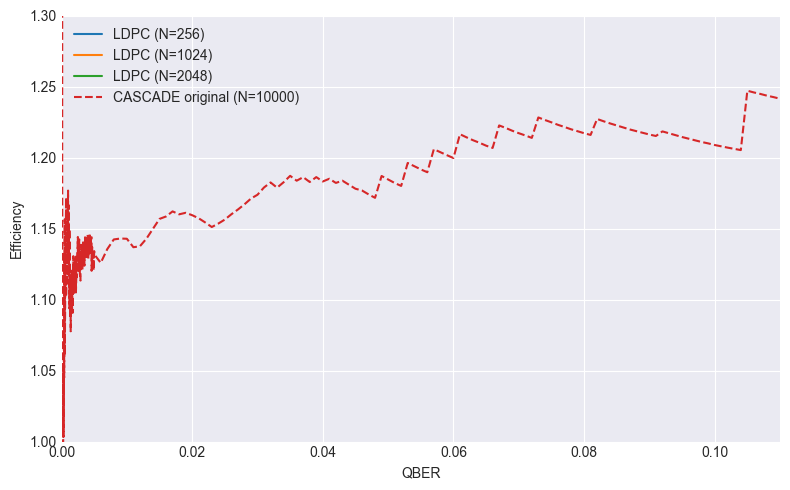

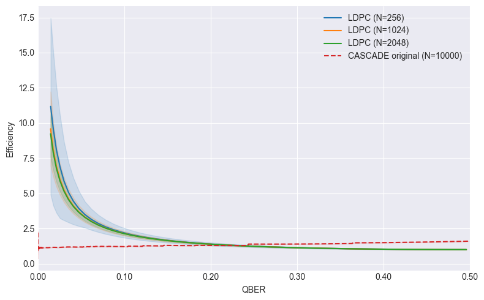

#### `cascade-cpp` author graph

Original Cascade efficiency (black line) in the QBER 0 - 0.1 matches up with my run (red line).

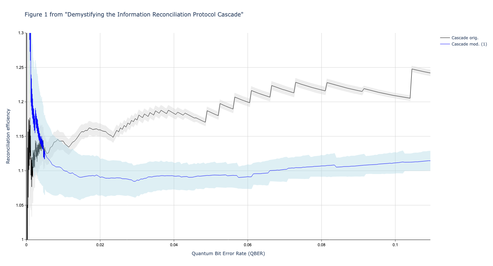

#### Figure 1 from *Demystifying the IR Protocol Cascade*

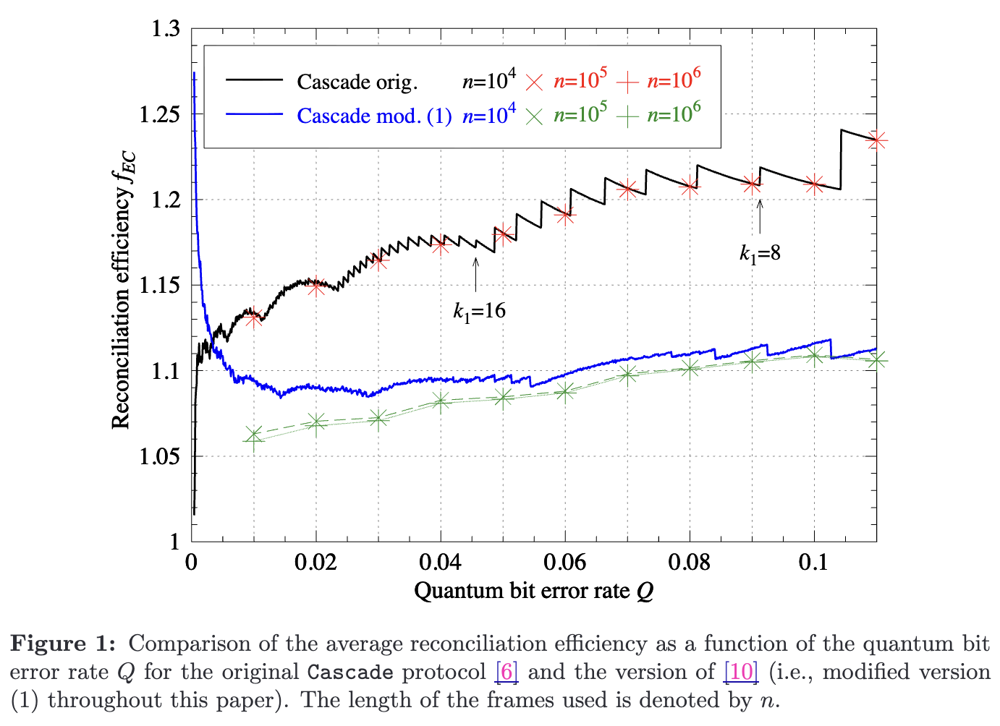

### LDPC

My 1-2*BER graph matches that of the original author (Ed).

(Why are we using this metric as a measure of performance over just BER?)

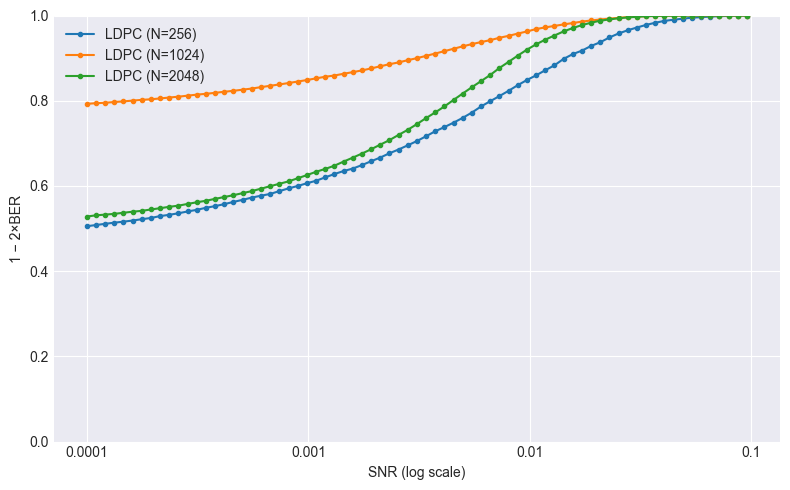

#### Ed's December update graph

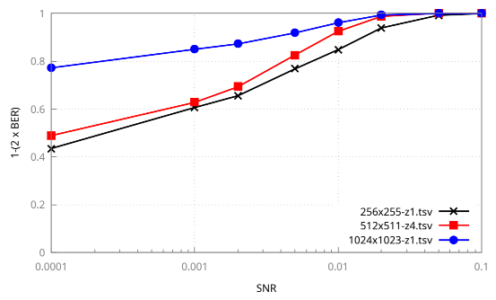

Not sure if matching to some literature is required/needed?

My xxx graph matches that of Figure x from "Some widely known LDPC literature"? I couldn't easily find any.

Surprisingly my FER and Ed's FER graphs do not line up. They are complete opposites so I suspect Ed may have plotted 1-FER instead of FER? Even after the change they don't quite line up, which is probably due to Ed packaging the frames into frame sizes of k bits (4096 in the graph) and considering FER to be 1 when any frame has a BER > 0 (my FER/ graph only considers frames of length k == matrix syndrome size, so for 256x255-z1.tsv each frame is 256 bits (1 info + 255 parity bits), FER is set to 1 when there is at least one remaining BER after LDPC min-sum decoding)

#### My FER

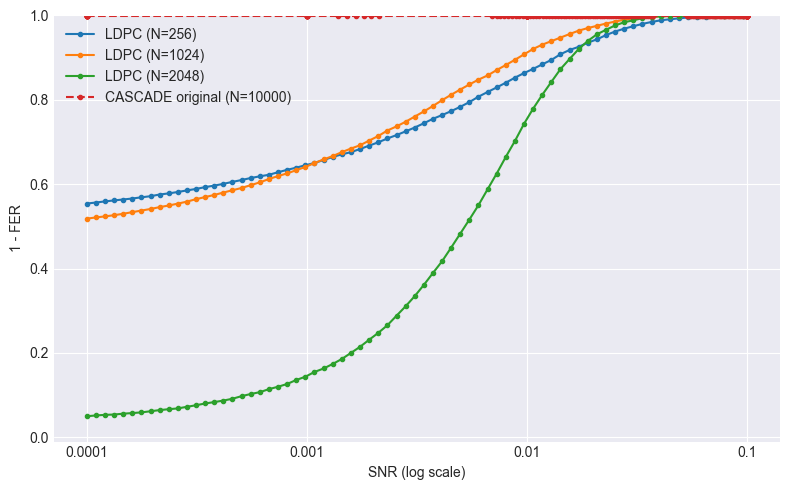

#### Ed's FER

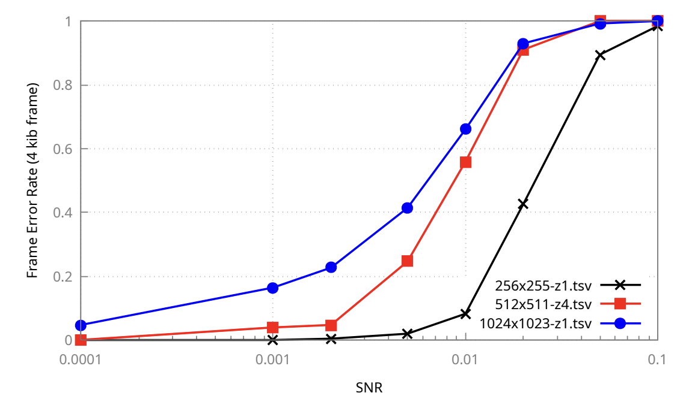

## Comparison

### Summary of methodology

LDPC and CASCADE differ fundamentally in their communication model:

- LDPC: one-way syndrome transmission with local decoding
- CASCADE: interactive parity exchange with repeated classical round-trips

They therefore cannot be compared on strictly identical terms. However, as information reconciliation schemes inside the same reverse-reconciliation GMCS CV-QKD framework, they do share a useful set of comparison metrics:

- reconciliation efficiency relative to the Shannon limit
- residual BER / FER after correction
- classical channel overhead
- computational cost
- latency sensitivity

For fairness, I use **pre-correction BER / QBER** as the main matched channel parameter.

On the LDPC side:

- I sweep **SNR** across the CV-QKD operating range.
- For each SNR, I run the full Gaussian channel plus 8D reconciliation pipeline.
- I then measure `actual_bit_error_rate` empirically from the hard decisions.
- That measured BER becomes the operating-point QBER for comparison.

( I've had a quick look into the BPSK formula, QBER ≈ ½ · erfc(√SNR), but since it doesn't match the channel (gaussian + 8d rotation) I don't see it having any use case, it's scattered about in various parts of the project (mainly graphing). Will remove once I confirm it's not needed [https://www.salimwireless.com/2025/11/understanding-q-function-in-bpsk.html] )

On the CASCADE side:

- I run experiments over `requested_bit_error_rate` on a binary symmetric channel.
- I then match those runs to LDPC operating points by aligning on measured BER / QBER.
- When plotting metrics against QBER, the x-axis is always the measured pre-correction BER seen by each algorithm.

Both algorithms are run `N` times per operating point:

- LDPC: `N` independent frames
- CASCADE: `N` independent full reconciliations

For LDPC, mean and sample standard deviation are accumulated online using Welford's algorithm. CASCADE uses one-pass accumulators but produces comparable mean and sample standard deviation outputs.

The LDPC decoder uses **Min-Sum decoding**, a low-complexity approximation of **Sum-Product / belief propagation** on a Tanner graph. The 8D preprocessing uses the **Leverrier-Grangier multidimensional reconciliation** scheme. CASCADE, in contrast, repeatedly partitions, shuffles, exchanges parities, and uses binary search / look-back to locate and correct errors.

This distinction matters especially for the CubeSat scenario, because CASCADE trades interaction for correction performance, while LDPC trades local computation for lower interaction. (FER and Remaining BER for CASCADE is always 0 because we don't yet model latency or constrain the time for a pass).

### Notes

- LDPC standard deviation is higher largely because the frame size is much smaller, so per-frame behavior is naturally more variable.
- Mueller et al. (2025) compare three LDPC frame sizes and compare CASCADE at the same key size as the largest LDPC frame. That is not currently the case here, since the tested LDPC frame sizes are much smaller?

## Metrics that are directly comparable

### Efficiency

`efficiency_avg / efficiency_std`

Same formula for both, already normalised per key bit:

`f = leaked_bits / (n * H(QBER))`

`Mueller et al. (2025)` use this in their Figure 3.

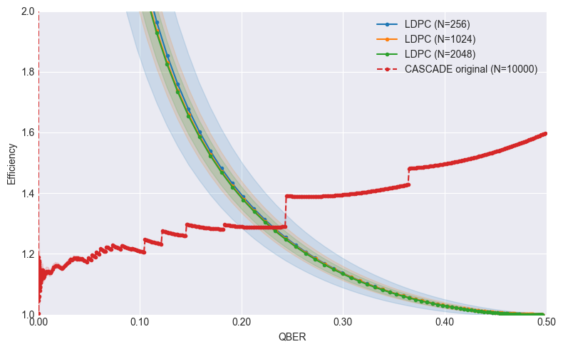

At `0.001` SNR, the LDPC pipeline gives about `0.487` QBER after Gaussian generation plus 8D rotation. What's the target range we should be looking at for LEO CubeSat?

Why is efficiency < 1 for LDPC at very high QBER, very low SNR ?
-> `f = leaked_bits / n * Binary Entropy`, Binary entropy is max at 0.5 QBER (= 1) -> So for 255x256 B matrix, syndrome len is fixed at 255 bits, so `f = 255 / 256 * 1 == approx 0.996`

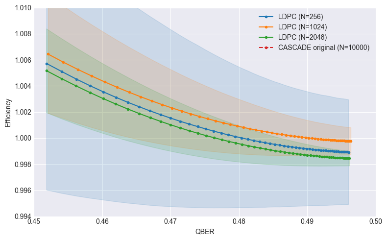

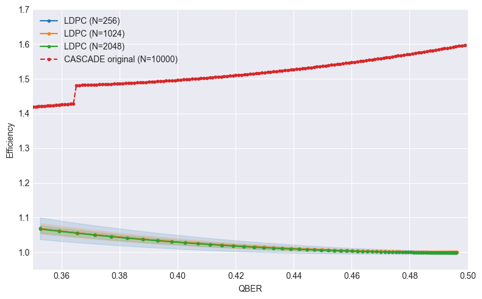

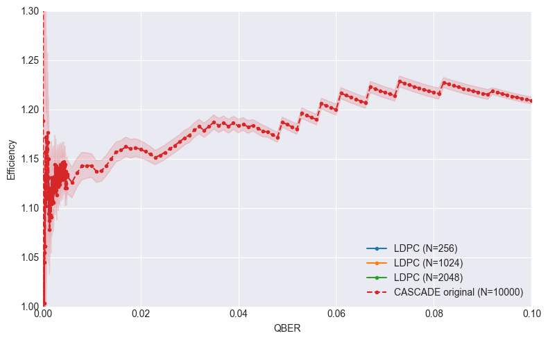

### Actual Bit Error Rate

`actual_bit_error_rate_avg / _std`

This measures the channel - It's a sanity check plot that shows that the operating points align.
It should be identical for both

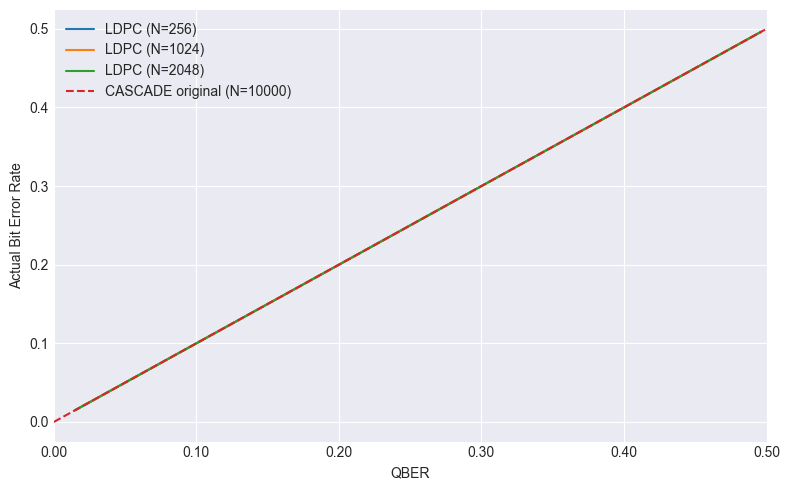

### Remaining Bit Error Rate

`remaining_bit_error_rate_avg / _std`

This is already normalised. Both algorithms should approach zero in their intended operating ranges.

CASCADE fully corrects all errors in these experiments because it is not currently restricted by latency or pass duration. (Mentioned further in Next Steps section below)

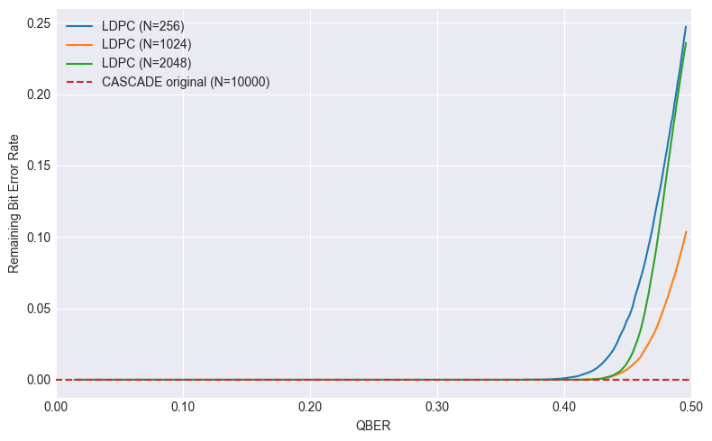

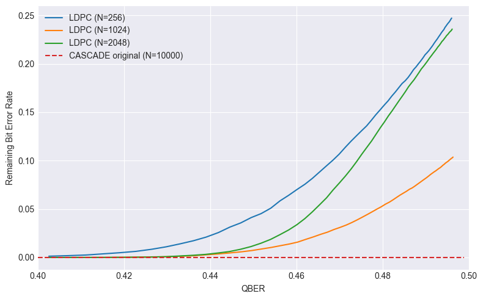

### Reconciliation Bits Per Key Bit / Reconciliation Bits

`reconciliation_bits_per_key_bit_avg / _std`

`Mueller et al. 2025` do  this in Figure 4 but they use a blind protocol for LDPC, over fixed-size like ours.

LDPC are `255/256`, `1023/1024`, `2044/2048` reconciliation bits per key bit, respectively. (Would I need to model a 120s pass, and find total reconciled bits per pass?)

The LDPC decoder does not send a hash/Checksum back to the sender to confirm the decoded key word is correct?

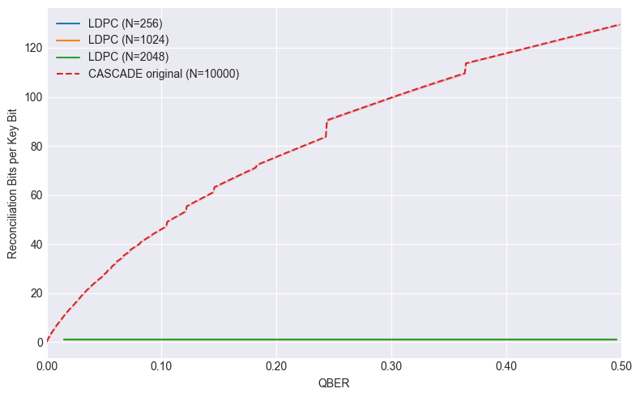

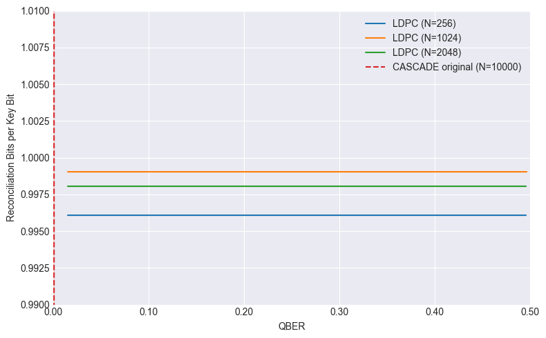

`reconciliation_bits_avg` graph for completeness, a little pointless since key_size is 10,000, so they look the same.

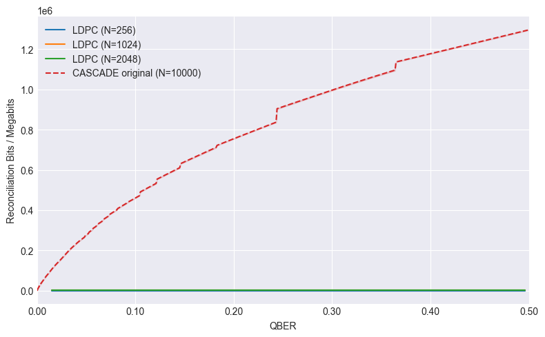

## Metrics that need dividing by `key_size`

LDPC processes much smaller frames than CASCADE in the current setup, so elapsed process and wall time should be normalised to:

`microseconds per key bit = elapsed_time / key_size`

The graphs suggest LDPC needs more processing and real time, especially at very low SNR / high QBER.

### Elapsed Process Time

`elapsed_process_time_avg`

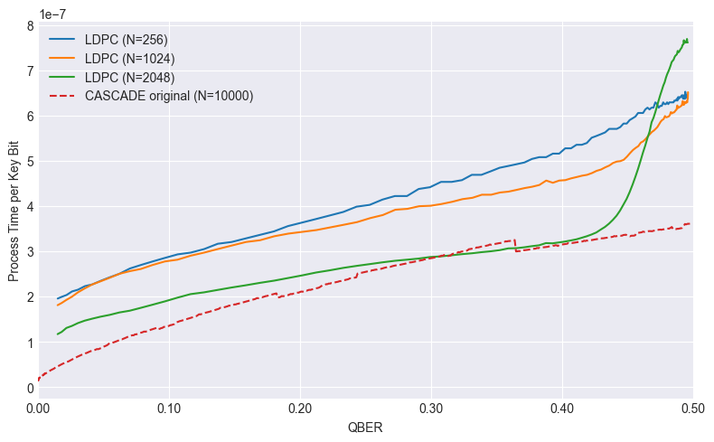

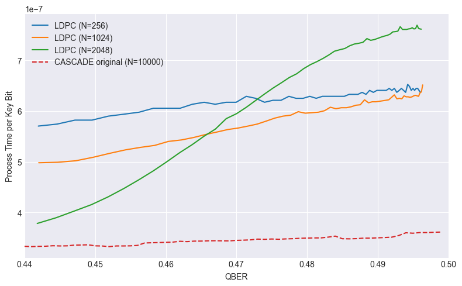

### Elapsed Real Time

`elapsed_real_time_avg`

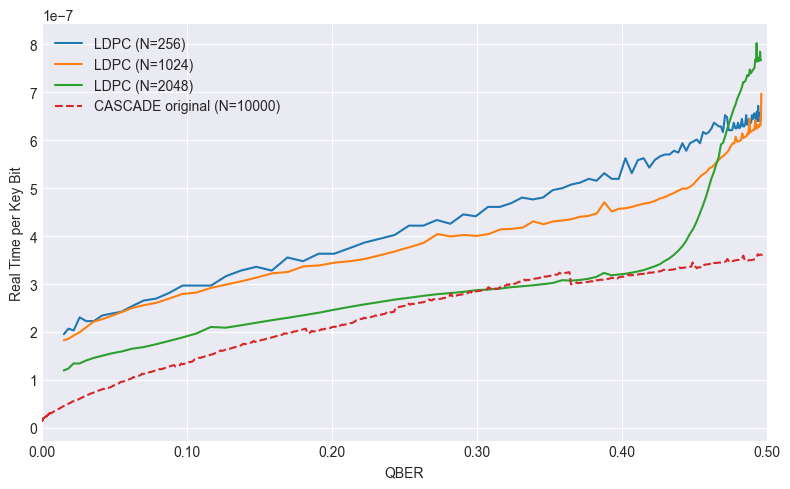

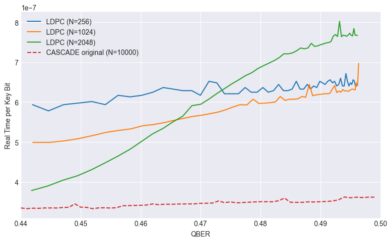

## Special case: Frame Error Rate (FER)

If the key sizes are left unmatched, then:

- LDPC FER = probability of any remaining error in one LDPC frame
- CASCADE FER = probability of any remaining error in one `10000`-bit CASCADE run

`Mueller et al.` handle this using `f_FER`, which folds FER into efficiency:

`f_FER = (1 - FER) * f + FER / H(q)`

Mention BER and FER about LDPC - We want to keep FER high at low SNR/high QBER so that the decoder does not "successfully" decode random noise, but at the target SNR we want to keep FER low, so that it successfully decodes/converges. Why does this not match up with Ed's December update graph? Surely you want to maximise FER when you have only noise, and minimise FER where you have signal?

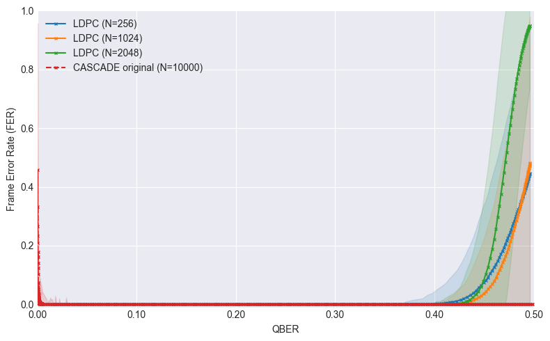

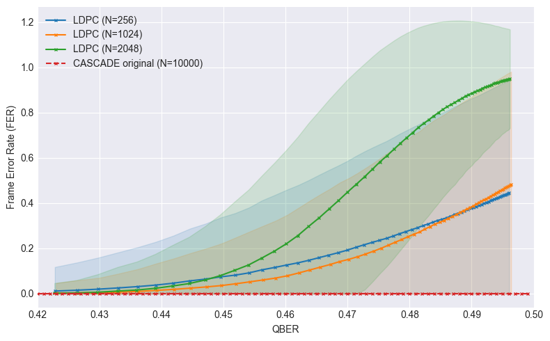

## Comparing iterations

Iterations in Cascade refers to count protocol rounds: each round shuffles the key, splits it into blocks, asks for parity, and corrects errors. (It is always set to 4 for ORIGINAL CASCADE). Equivalent to round-trips.

Iterations in LDPC refers to number of Min-Sum decoder iterations (vary based on difficulty of syndrome/ likelihood values)

They measure different things and are not directly comparable.

## Constraints modelling for LEO CubeSat

The important systems question is not just which algorithm has the better efficiency curve, but which algorithm is actually deployable under LEO CubeSat constraints.

To answer that, I want to translate the measured experiment statistics into a simple systems model with explicit:

- pass duration
- bandwidth
- latency
- compute budget
- memory budget

As a first approximation, I model a single satellite pass as a constant-SNR operating window of about `120 s`. This is obviously a simplification — in reality elevation angle, turbulence, pointing, background light and link margin vary continuously over the pass — but it is a reasonable first step because it allows each algorithm to be evaluated at a fixed operating point. WHAT TO REFERENCE FOR CONSTANT-SNR DECISION?

The quantum side of the link is assumed to run from a **2.0 MHz laser clock**, which gives the upper bound on how fast raw quantum variables arrive and therefore how much reconciliation work the classical side must keep up with. I am not yet converting this directly into final secret-key throughput, because that also depends on parameter estimation, privacy amplification and exactly how many shared bits are extracted per quantum variable after multidimensional reconciliation. However, the 2.0 MHz figure is still useful as a **pressure test**: any reconciliation method whose compute time or classical messaging overhead cannot keep pace with the incoming data stream is unlikely to be viable onboard, even before the rest of the key-distillation stack is added.

### Main constraints to model

- **Limited pass duration**: A candidate method must reconcile a meaningful amount of data within the ~120 s window. This turns the measured per-frame or per-key timings into an end-to-end throughput question: how many successfully reconciled bits can be delivered before the pass ends?
- **Limited onboard compute**: LDPC may benefit from one-way communication but still fail feasibility if the decoder cost per useful bit is too high on actual hardware.
- **Limited memory**: LDPC needs storage for parity-check matrices, LLRs, syndromes and frame buffers, whereas CASCADE needs larger key buffers, shuffle state, block bookkeeping and parity-tracking structures across multiple passes.
- **Classical channel bandwidth**:  The satellite classical link is rate-limited (uplink/downlink bands as provided in the system description), so the tracked metrics `reconciliation_bits` and `reconciliation_bits_per_key_bit` can be converted into transmission-time estimates. 
- **Classical channel latency**: especially important for CASCADE due to sequential exchanges. In the tracked stats this appears through quantities such as `ask_parity_messages`; for LDPC, the currently modelled reverse-reconciliation workflow is effectively **one-way, one classical block per frame** (multidimensional-reconciliation side information + syndrome), so its latency cost is much closer to a single transmission than to a long interactive exchange.
- **Reconciliation quality**: the method must achieve acceptable BER / FER and efficiency. [Not sure how I'd argue where the limits of good/bad quality are]

### First-order time model

`T_total ≈ T_compute + T_classical_tx + T_latency`

where:

- `T_compute` comes from the measured `elapsed_process_time` / `elapsed_real_time`, scaled to the expected onboard processor;
- `T_classical_tx ≈ reconciliation_bits / classical_link_rate`;
- `T_latency ≈ n_messages × propagation_or_round-trip_delay`, where `n_messages` is small for LDPC and potentially large for CASCADE.

This naturally leads to a throughput estimate such as:

`useful reconciled bits per pass ≈ (1 - FER) × key_size × number_of_reconciliations_completed_within_120s`

or, equivalently, a bits-per-second figure that can be compared against the incoming raw data rate implied by the 2.0 MHz source.

### Feasibility checklist

In practical terms, this means the LEO CubeSat feasibility question becomes a checklist rather than a single metric:

- Does the algorithm meet the target operating BER / FER in the expected SNR range?
- Does it achieve acceptable reconciliation efficiency (ideally close to the 98% target, i.e. β ≈ 0.98 or η ≈ 1/0.98)?
- Can the required classical communication fit within the available bandwidth budget?
- Can the interaction pattern tolerate the latency budget of the link?
- Can the onboard processor plausibly keep up with the incoming quantum-variable rate over a 2 minute pass?
- Is the memory footprint reasonable for the platform?

## Feasibility matrix

should be the final condensed output of the constraints model above. Rather than asking only “which algorithm has the best efficiency?”, the matrix asks “which algorithm is actually compatible with the CubeSat system constraints at the target operating point?”.

something like:

| Algorithm / Variant | Target SNR / QBER reachable? | Efficiency acceptable? | Residual BER / FER acceptable? | Classical bits within budget? | Message / latency budget acceptable? | Compute budget acceptable? | Memory budget acceptable? | Overall |
|---|---|---|---|---|---|---|---|---|
| LDPC `256x255 z1` |  |  |  |  |  |  |  |  |
| LDPC `512x511 z4` |  |  |  |  |  |  |  |  |
| LDPC `1024x1023 z1` |  |  |  |  |  |  |  |  |
| CASCADE original |  |  |  |  |  |  |  |  |
| CASCADE BICONF / option 7 / etc. |  |  |  |  |  |  |  |  |

The most useful way to fill this is probably with a simple `yes / borderline / no`, supported by one or two key numbers from the plots.

This also gives me a clean way to include algorithm variants without drowning the report in plots: even if I do not show every variant in full detail, I can still summarise whether a given variant is promising, borderline, or clearly unsuitable for the LEO CubeSat scenario.

## Next steps

- add `total successfully reconciled bits per pass` as a metric? will need to model time of frame (something like compute + transmission + latency time), and then see how many frames we can get per 120s pass, multiply that by key_size if frame succeeded otherwise 0 bits.

- Compare the variations of CASCADE? None of the currently available cascade-cpp variants seem to have a reasonable efficiency at the likely low-SNR / high-QBER operating points of interest for LEO CV-QKD. There is, however, a newer **modified / improved Cascade** used in the 2025 LDPC-vs-CASCADE comparison, based on later literature that improves the original protocol. That specific improved variant is not implemented directly in cascade-cpp (I believe option 7 is the closest).

- Show which algorithm variation is viable at what SNR for this LEO scenario?

- Run on real hardware? Compare Memory usage?

- What to do with B-Matrices, which ones to compare?

- Can I commit branch to GitHub?

- More thorough computational / memory comparison?

- Make CASCADE use key_size power of 2, as mentioned in the newer 2025 comparison

- How to deal with latency? FER in CASCADE is P(bit error after reconciliation) in key_size(10000 bits), at the moment because we don't model latency (messages are passed instantly), and we don't restrict the pass duration, the FER always ends up as 0 (reconciled key is fully correct). Decide how to model latency more realistically?

- Decide whether energy estimates are worth including.

- What to do next? Need to keep in mind I only have a few weeks left to write up and submit final report at the end of April.
